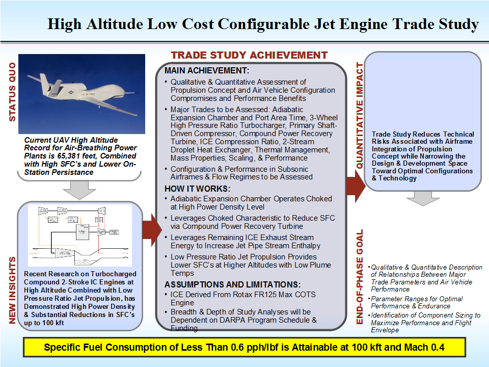
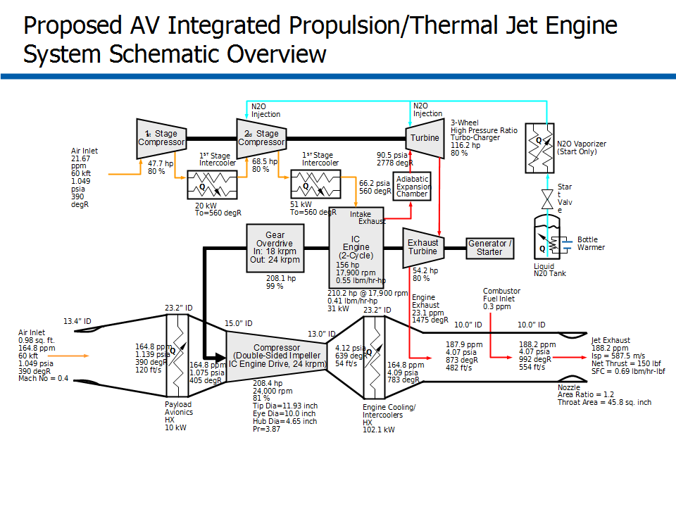
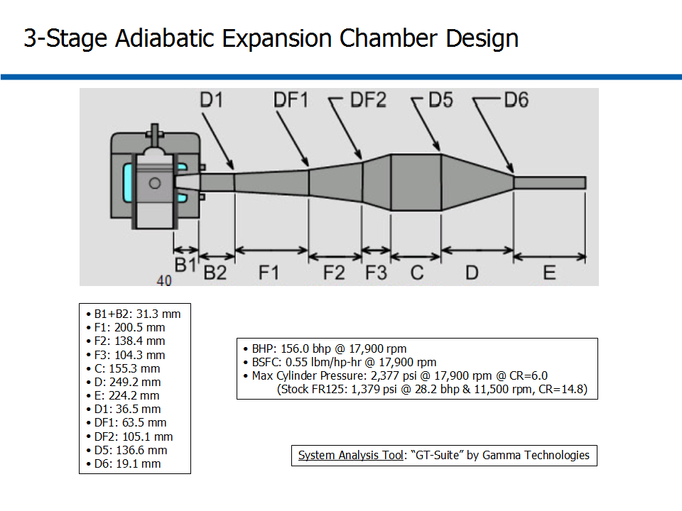

# ========================================
# High-Output Adiabatic-Choked 3-Stage Two-Stroke ICE Expansion Chamber Design Optimization 0kft to 100kft Altitude Operation:
# ========================================

## I. Design Context Overview:

## 
## 
## II. Integraged Propulsion/Thermal System Schematic Diagram:

## 
## 
## III. Modified COTS ICE: Rotax FR125 MAX:

## 
## 
## IV. Choked/Adiabatic 3-Stage Expansion Chamber Design @ 17,900 RPM:

## 
## 
## V. High-Output Two-Stroke ICE BHP/BSFC/Max Cylinder Pressure vs. RPM:

## 
## 
## VI. Performance Summary of High-Output/High-Altitude Two-Stroke ICE:

## 
## *Note: Performance Data and Analysis performed using "GT-Suite", Gamma Technologies Inc.